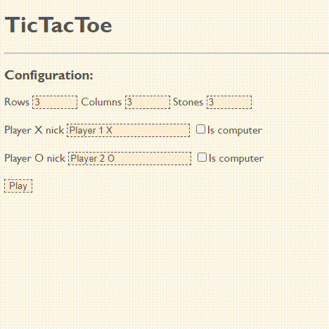

# Advanced TicTacToe in PHP

This project is an advanced implementation of the classic TicTacToe game, built primarily as a playground for two pursuits:

1. **Exploring New PHP Versions**: With the rapid evolution of PHP, I wanted a hands-on environment to test, understand, and adapt to the latest features and nuances of the language. This project is currently set up with PHP 8.2, allowing for exploration of its capabilities.

2. **Experimenting With Game Algorithms**: The AI logic in this game integrates a combination of the MinMax algorithm, scoring techniques, and recursive exploration. Building a game like TicTacToe has offered a comprehensive platform to comprehend, implement, and optimize these methods for generating AI-based move recommendations.

Beyond the experimental aspects, the game offers a dynamic take on TicTacToe, allowing for customizable board sizes, win conditions (number of stones in a line), and a choice between human and AI-controlled players. This project doesn't rely on a specific framework, instead, it leverages a minimalistic approach with a simple routing mechanism and very few dependencies.

## Features

- **Customizable Board Size**: Tailor your gameboard according to your preference.
- **Custom Win Conditions**: Decide the number of consecutive stones required for a win.
- **Move Recommendations**: Gain insights on the optimal next move based on the current state of the board.
- **AI-controlled player**: Choose between human or AI-controlled participants.



## Installation & Setup
To get this game up and running, you'll need Docker. Ensure you have both Docker and Docker Compose installed on your machine before proceeding.

### Steps:

1. **Clone the Repository**:

    ```bash
    git clone https://github.com/22bran/tictactoe-php-frameworkless.git && cd tictactoe-php-frameworkless
    ```
2. **Build the Docker Container**:

    Use Docker Compose to build and start the service:

    ```bash
    docker-compose up --build -d
    ```

3. **Install PHP Dependencies**:

    Once the Docker container is running, install the PHP dependencies using Composer inside the container. You can achieve this by running the following command:

    ```bash
    docker-compose exec php composer install
    ```

4. **Access the Application**:

    After running the commands above, access the game in your browser at:

    ```
    http://localhost:8080
    ```

## License
This project is licensed under the MIT License - see the LICENSE.md file for details.